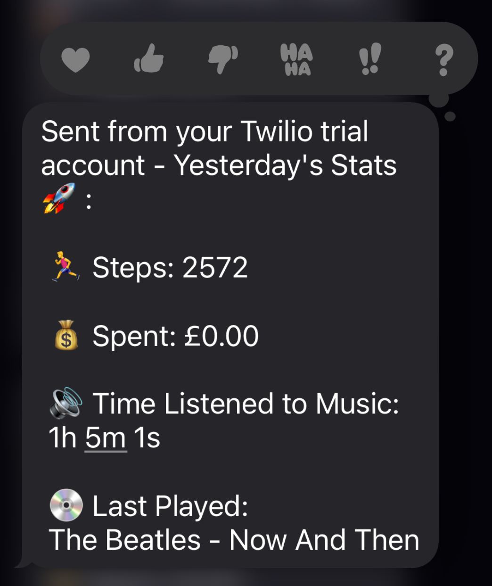

# 📈 Life-Stats

Life-Stats is a Ruby script that automates sending me daily text messages with key statistics about my previous day, such as money spent and steps taken.

# 📩 How it works 

The system operates in two main phases. Initially, at the end of each day, a script is executed to gather data from various APIs. It then compiles this information into a data object and saves it to a JSON file. The following morning, another script runs, retrieves the latest data object from the JSON file (representing yesterday's data), and formats this data into an SMS message, which is sent via Twilio.

# 🌄 Screenshots

